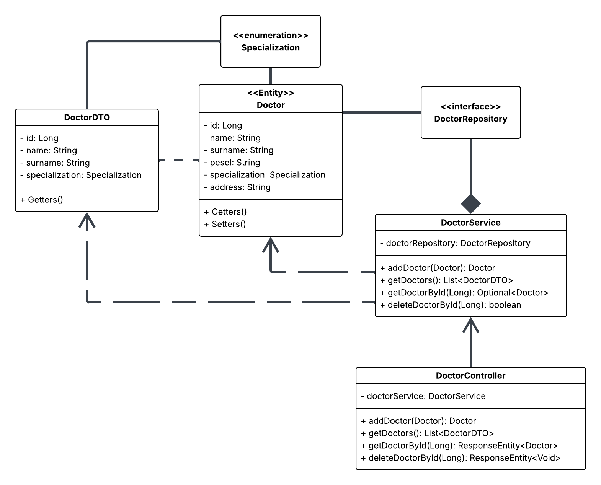
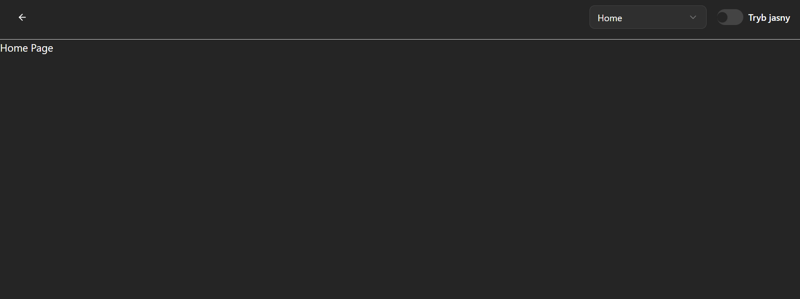
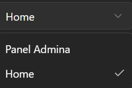
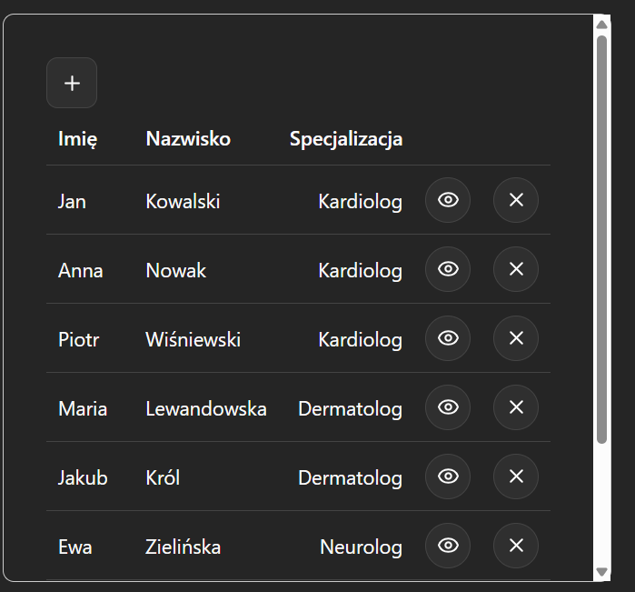
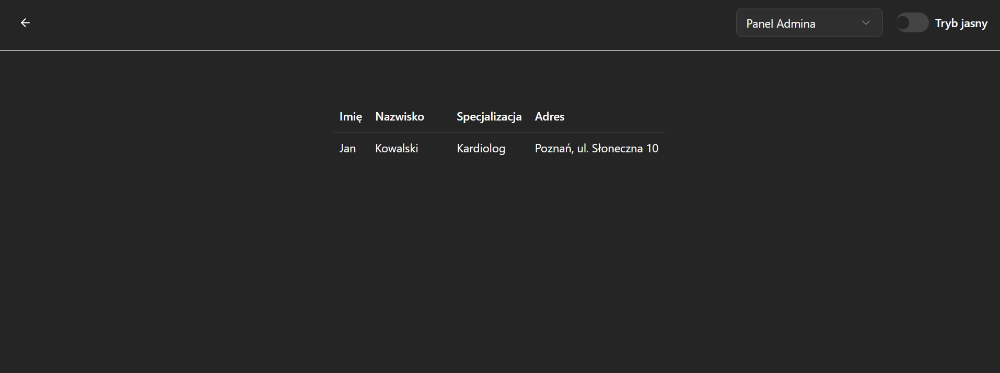
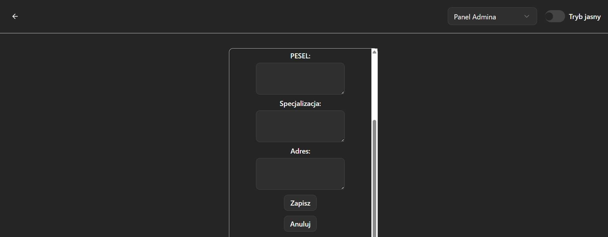
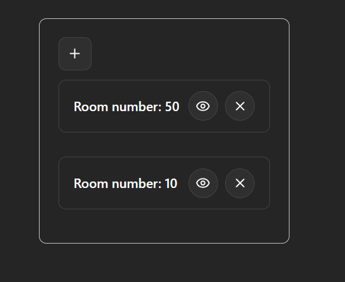
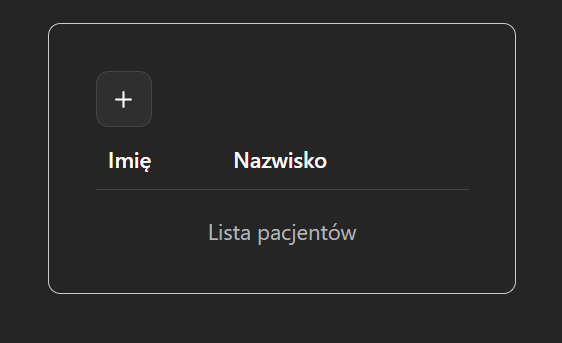

# DK-czw-0800-Pacjenci-Debuggera

## Diagram UML



## Zaimplementowane funkcjonalności m1

### Zarządzanie lekarzami

1. **Dodanie lekarza** - `POST /doctors/add`
   - Pola: imię, nazwisko, PESEL, specjalizacja, adres

2. **Wyświetlenie listy lekarzy** - `GET /doctors`
   - Zwraca: imię, nazwisko, specjalizacja

3. **Wyświetlenie szczegółów lekarza** - `GET /doctors/{id}`
   - Zwraca: imię, nazwisko, specjalizacja, adres

4. **Usunięcie lekarza** - `DELETE /doctors/{id}`

## Uruchomienie backendu

```bash
cd clinic
./gradlew bootRun
```

Backend: `http://localhost:8080`

## Uruchomienie frontendu

```bash
cd frontend
npm install -g npm
npm i
npm run dev
```

Frontend: `http://localhost:5173`

## Korzystanie z aplikacji

Na początku znajdujemy się na stronie głównej 

 

Aby zmienić stronę klikamy w Selecta i zmieniamy na Panel Admina

 

Teraz mamy wyświetloną listę wszystkich dostępnych lekarzy

### Funkcjonalności w panelu lekarza



* Aby wyświetlić szczegóły klikamy w oko



* Aby dodać lekarza klikamy w +



* Aby usunąć lekarza klikamy w x

### Dodane panele

Panele gabinetów - można dodawać gabinety (+) lub je usuwać (x)



Panel pacjentów

