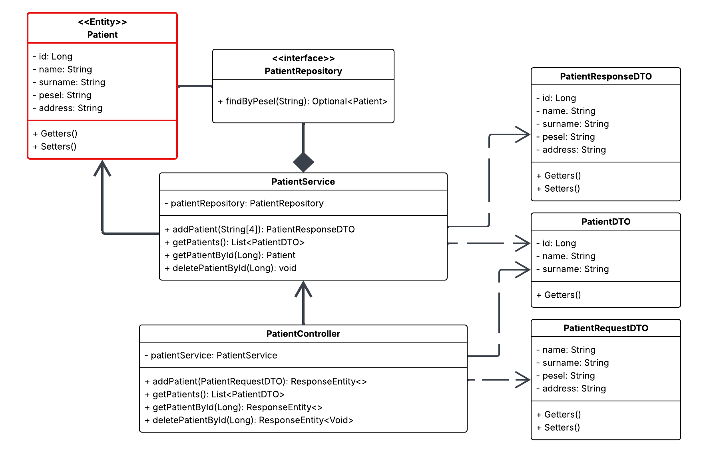
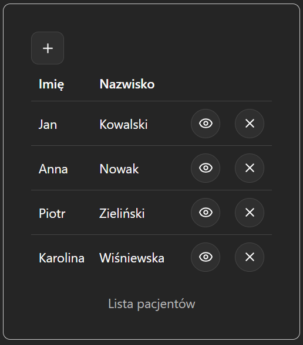
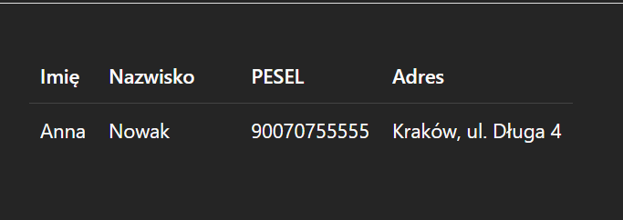
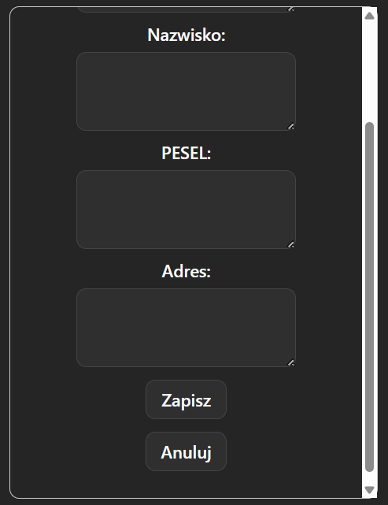

# DK-czw-0800-Pacjenci-Debuggera

## Diagram UML




## Zaimplementowane funkcjonalności m1

### Zarządzanie lekarzami

1. **Dodanie lekarza** - `POST /doctors/add`

   - Pola: imię, nazwisko, PESEL, specjalizacja, adres

2. **Wyświetlenie listy lekarzy** - `GET /doctors`

   - Zwraca: imię, nazwisko, specjalizacja

3. **Wyświetlenie szczegółów lekarza** - `GET /doctors/{id}`

   - Zwraca: imię, nazwisko, specjalizacja, adres

4. **Usunięcie lekarza** - `DELETE /doctors/{id}`

## Zaimplementowane funkcjonalności m2

### Zarządzanie gabinetami

1. **Dodanie gabinetu** - `POST /offices/add`
   - Pole: numer gabinetu
2. **Wyświetlanie listy gabinetów** - `GET /offices`
3. **Usunięcie gabinetu** - `DELETE /offices/{id}`
4. **Wyświetlanie listy dyżurów w gabinecie** - `GET /offices/{id}/shifts`
   - Zwraca: informacje o lekarzu, godzinach i dniu jego dyżuru

### Zarządzanie pacjentami

1. **Dodanie pacjenta** - `POST /patients/add`
   - Pola: imię, nazwisko, PESEL, adres
1. **Wyświetlenie listy pacjentów** - `GET /patients`
   - Zwraca: imię, nazwisko
1. **Wyświetlenie szczegółów pacjenta** - `GET /patients/{id}`
   - Zwraca: imię, nazwisko, adres, PESEL
1. **Usunięcie pacjenta** - `DELETE /patients/{id}`

### Zarządzanie dyżurami

1. **Dodanie dyżuru** - `POST /shifts/add`
   - Pola: id lekarza, id gabinetu, dzień tygodnia, godziny rozpoczęcia i końca
2. **Wyświetlanie listy dyżurów** - `GET /shifts`
   - Zwraca: informacje o lekarzu, informacje o gabinecie, godziny, dzień tygodnia
3. **Usunięcie dyżuru** - `DELETE /shifts/{id}`

### Zarządzanie lekarzami

Dodane zostało zapytanie o **dyżury lekarza** - `GET /doctors/{id}/shifts`

## Uruchomienie backendu

```bash
cd clinic
./gradlew bootRun
```

Backend: `http://localhost:8080`

## Uruchomienie frontendu

```bash
cd frontend
npm install -g npm
npm i
npm run dev
```

Frontend: `http://localhost:5173`

## Korzystanie z aplikacji

Na początku znajdujemy się na stronie głównej


Aby zmienić stronę klikamy w Selecta i zmieniamy na Panel Admina


Teraz mamy wyświetloną listę wszystkich dostępnych lekarzy

### Funkcjonalności w panelu lekarza


- Aby wyświetlić szczegóły klikamy w oko


- Aby dodać lekarza klikamy w +


- Aby usunąć lekarza klikamy w x

### Dodane panele

#### Panele gabinetów - można dodawać gabinety (+) lub je usuwać (x)


Szczegóły gabinetów


#### Panel pacjentów



Szczegóły pacjentów



Pacjentów też można dodać


