# DK-czw-0800-Pacjenci-Debuggera

## Diagram UML

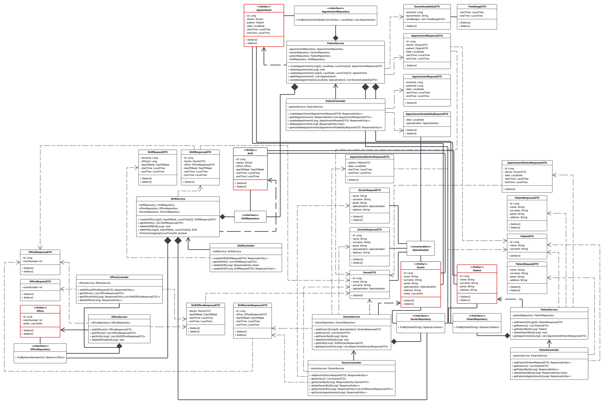

## Zaimplementowane funkcjonalności m1

### Zarządzanie lekarzami

1. **Dodanie lekarza** - `POST /doctors/add`

   - Pola: imię, nazwisko, PESEL, specjalizacja, adres

2. **Wyświetlenie listy lekarzy** - `GET /doctors`

   - Zwraca: imię, nazwisko, specjalizacja

3. **Wyświetlenie szczegółów lekarza** - `GET /doctors/{id}`

   - Zwraca: imię, nazwisko, specjalizacja, adres

4. **Usunięcie lekarza** - `DELETE /doctors/{id}`

## Zaimplementowane funkcjonalności m2

### Zarządzanie gabinetami

1. **Dodanie gabinetu** - `POST /offices/add`
   - Pole: numer gabinetu
2. **Wyświetlanie listy gabinetów** - `GET /offices`
3. **Usunięcie gabinetu** - `DELETE /offices/{id}`
4. **Wyświetlanie listy dyżurów w gabinecie** - `GET /offices/{id}/shifts`
   - Zwraca: informacje o lekarzu, godzinach i dniu jego dyżuru

### Zarządzanie pacjentami

1. **Dodanie pacjenta** - `POST /patients/add`
   - Pola: imię, nazwisko, PESEL, adres
1. **Wyświetlenie listy pacjentów** - `GET /patients`
   - Zwraca: imię, nazwisko
1. **Wyświetlenie szczegółów pacjenta** - `GET /patients/{id}`
   - Zwraca: imię, nazwisko, adres, PESEL
1. **Usunięcie pacjenta** - `DELETE /patients/{id}`

### Zarządzanie dyżurami

1. **Dodanie dyżuru** - `POST /shifts/add`
   - Pola: id lekarza, id gabinetu, dzień tygodnia, godziny rozpoczęcia i końca
2. **Wyświetlanie listy dyżurów** - `GET /shifts`
   - Zwraca: informacje o lekarzu, informacje o gabinecie, godziny, dzień tygodnia
3. **Usunięcie dyżuru** - `DELETE /shifts/{id}`

### Zarządzanie lekarzami

Dodane zostało zapytanie o **dyżury lekarza** - `GET /doctors/{id}/shifts`

## Zaimplementowane funkcjonalności m3

### Zarządzanie wizytami (Appointment)

1. **Dodanie wizyty** - `POST /appointments/add`

   - Pola: id lekarza, id pacjenta, data, godzina rozpoczęcia i zakończenia
   - Walidacja: wizyta możliwa tylko gdy lekarz ma dyżur w danym terminie
   - Walidacja: wykrywanie konfliktów z istniejącymi wizytami

2. **Wyświetlenie listy wizyt** - `GET /appointments`

   - Zwraca: informacje o lekarzu, pacjencie, dacie i godzinach

3. **Edycja wizyty** - `PUT /appointments/{id}`

   - Pozwala na zmianę lekarza, pacjenta, daty i godzin

4. **Usunięcie wizyty** - `DELETE /appointments/{id}`

5. **Sprawdzenie dostępności** - `POST /appointments/availabilities`
   - Pola: data, specjalizacja
   - Zwraca: listę lekarzy z ich dostępnymi przedziałami czasowymi

### Rozszerzenie zarządzania pacjentami

1. **Wyświetlenie wizyt pacjenta** - `GET /patients/{id}/appointments`
   - Zwraca: listę wizyt danego pacjenta z informacjami o lekarzu

### Testy jednostkowe

Dodane testy dla wszystkich serwisów:

- `AppointmentServiceTests` - 38 testów
- `PatientServiceTests` - 35 testów

## Uruchomienie backendu

```bash
cd clinic
./gradlew bootRun
```

Backend: `http://localhost:8080`

## Uruchomienie frontendu

```bash
cd frontend
npm install -g npm
npm i
npm run dev
```

Frontend: `http://localhost:5173`

## Korzystanie z aplikacji

Na początku znajdujemy się na stronie głównej

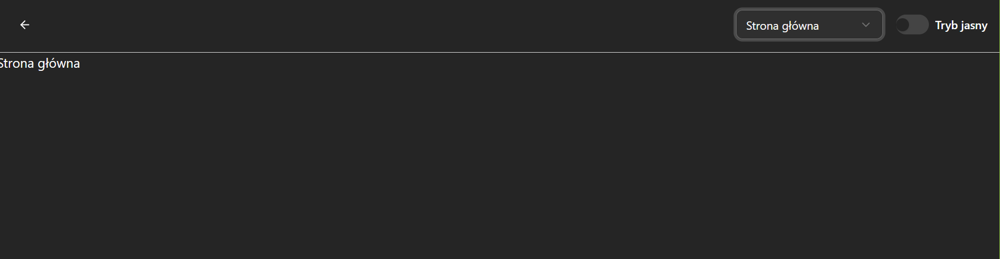

Aby zmienić stronę klikamy w Selecta i zmieniamy na dowolny panel

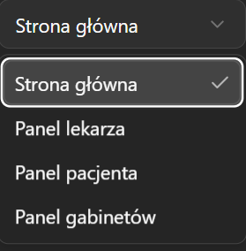

Przykładowo klikając na **Panel lekarza** mamy wyświetloną listę wszystkich dostępnych lekarzy

### Funkcjonalności w panelu lekarza

#### Wyświetlanie lekarzy

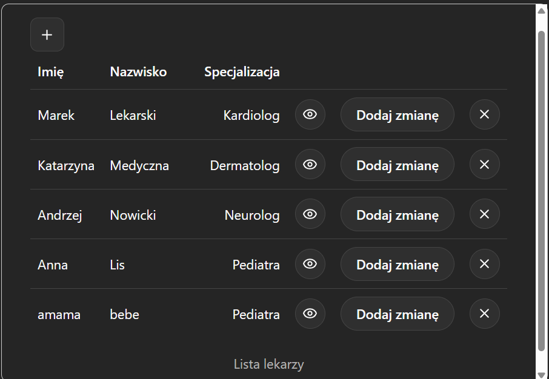

- Aby wyświetlić szczegóły klikamy w oko
- Aby usunąć lekarza klikamy w x
- Aby dodać lekarza klikamy w +
- Aby dodać zmianę klikamy w Dodaj zmianę

#### Wyświetlanie szczegółów lekarza

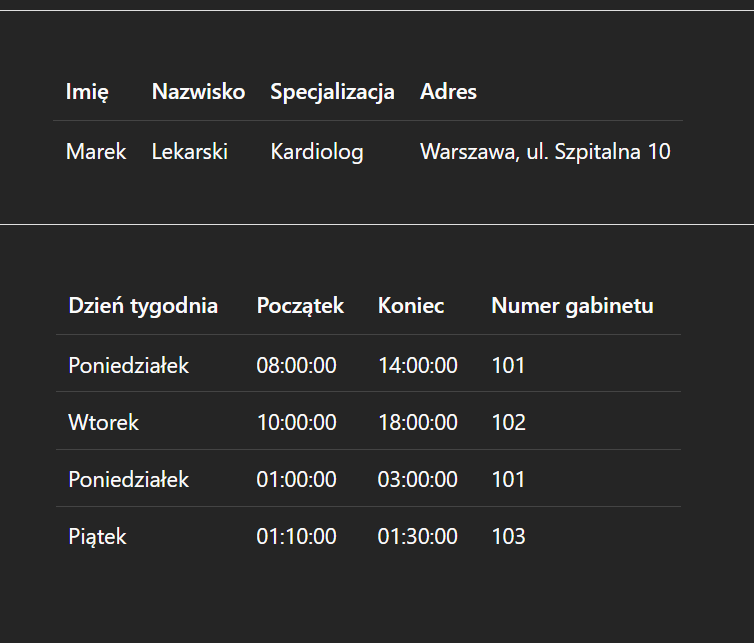

W szczegółach można też usunąć dyżur

#### Dodawanie lekarza

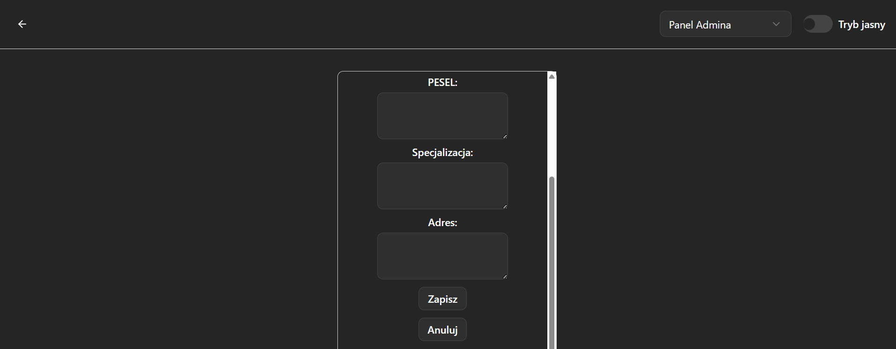

#### Dodanie zmiany

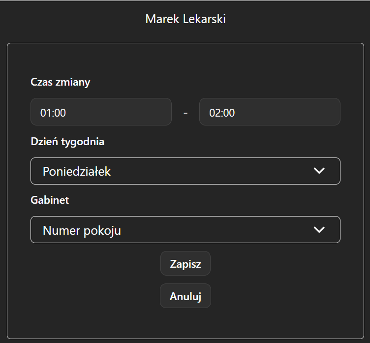

### Panel gabinetów

- Aby wyświetlić szczegóły klikamy w oko
- Aby usunąć gabinet klikamy w x
- Aby dodać gabinet klikamy w +

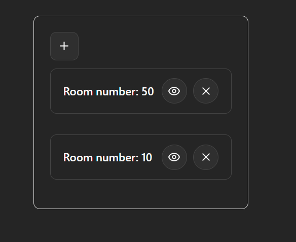

#### Dodawanie gabinetów

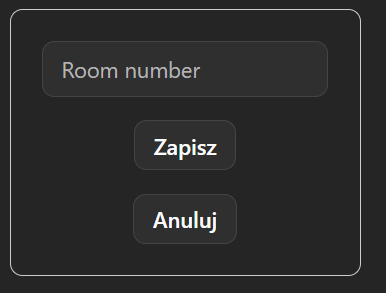

#### Szczegóły gabinetów

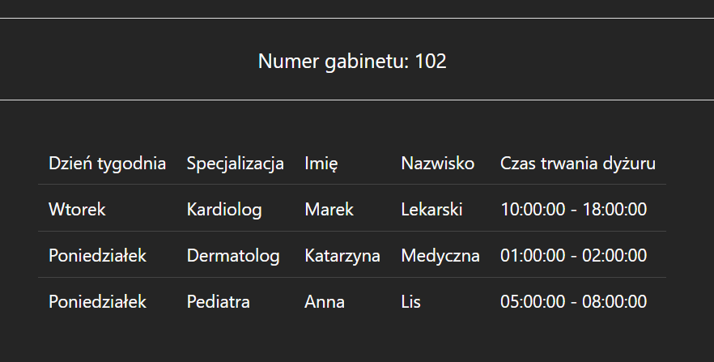

### Panel pacjentów

- Aby wyświetlić szczegóły klikamy w oko
- Aby usunąć pacjenta klikamy w x
- Aby dodać pacjenta klikamy w +
- Aby umówić wizytę klikamy w Umów wizytę

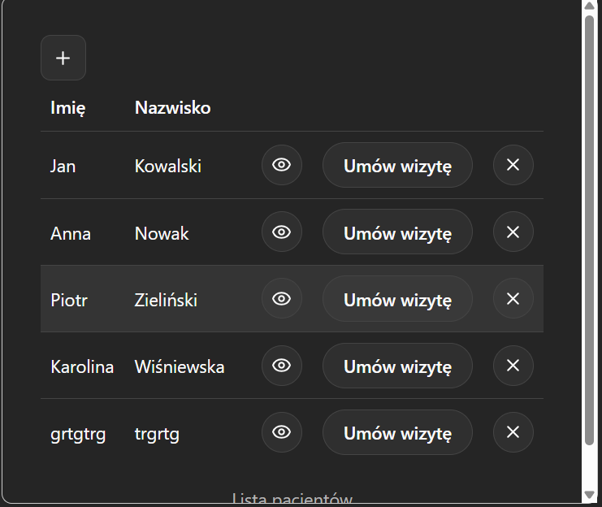

#### Szczegóły pacjentów

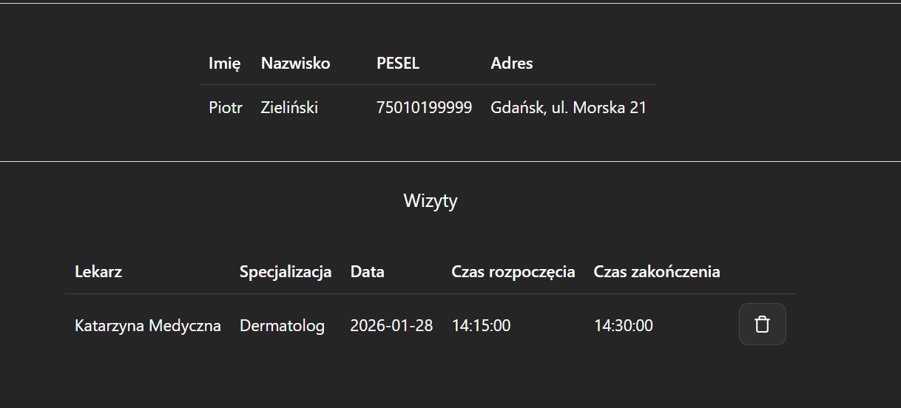

W szczegółach pacjentów można usunąć też wizytę

#### Dodawanie wizyty

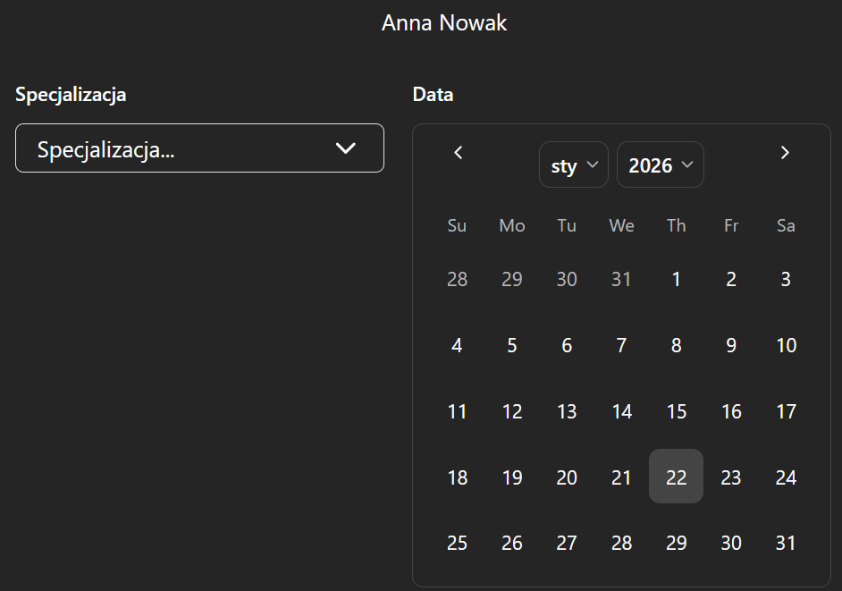

Należy najpierw wybrać specjalizację i datę w kalendarzu i następnie będą sie pokazywaały następne parametry

#### Dodawanie pacjentów


